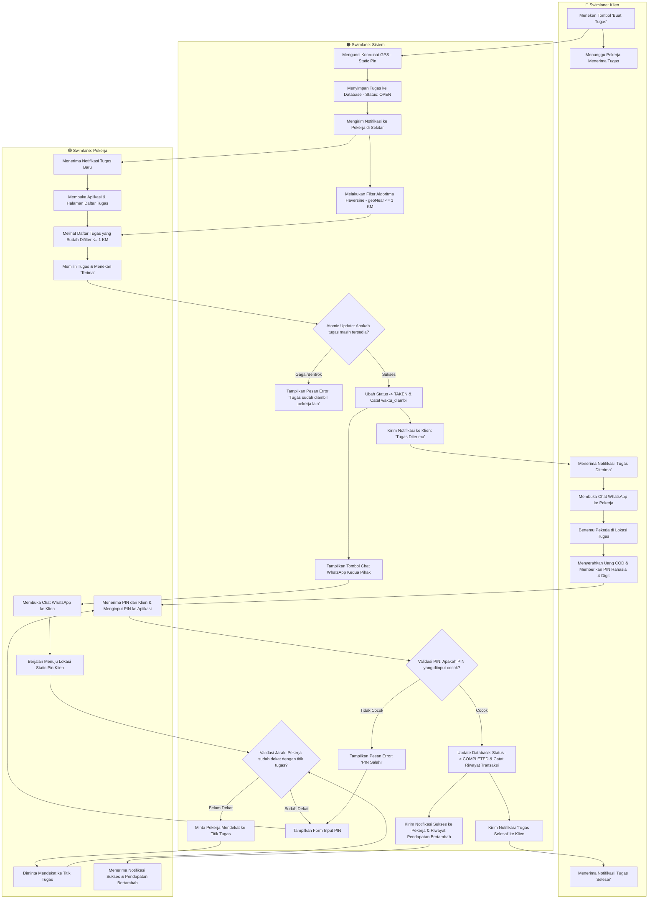
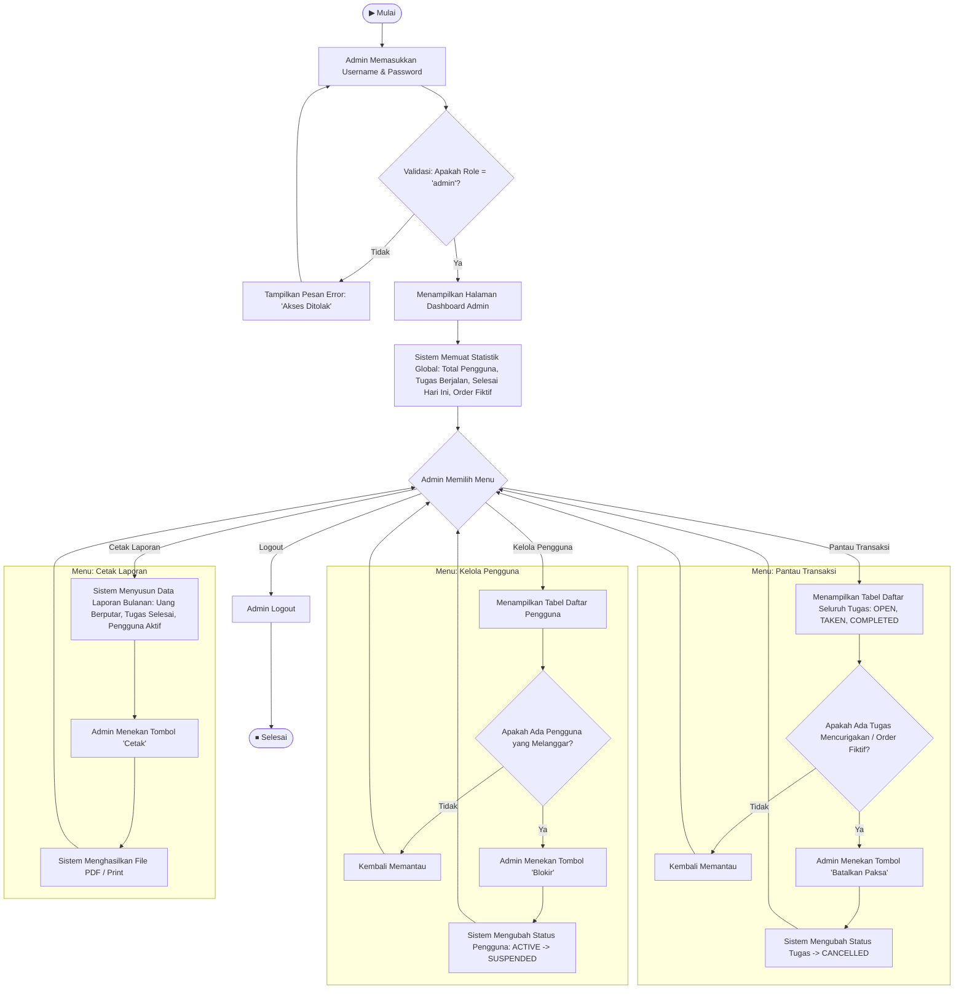
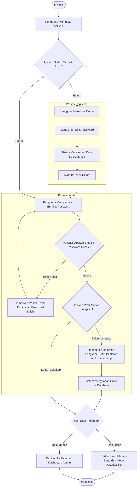

# Kumpulan Flowchart Mermaid - Skripsi Micro-Tasking Hyperlocal

Berikut adalah kode Mermaid untuk seluruh flowchart yang dibutuhkan skripsi. 
Salin kode ke Draw.io (Extras > Edit Diagram > Mermaid) atau ke [Mermaid Live Editor](https://mermaid.live).

---

## 1. Flowchart Transaksi Utama (Klien ↔ Sistem ↔ Pekerja)

> Ini adalah flowchart utama skripsi, sesuai dengan gambar swimlane yang sudah Anda buat.

---

## 2. Flowchart Admin Dashboard

> Flowchart terpisah khusus untuk aktor Admin, sesuai Use Case Diagram (Memantau Transaksi, Mengelola Data Pengguna).

---

## 3. Flowchart Registrasi & Login

> Alur masuk pengguna ke dalam sistem (berlaku untuk Klien, Pekerja, dan Admin).

---

## Catatan Penting

> [!TIP]
> - **Flowchart 1** (Transaksi Utama) adalah yang paling penting untuk skripsi karena mendemonstrasikan Algoritma Haversine.
> - **Flowchart 2** (Admin) wajib ada karena di Use Case Diagram sudah tercantum aktor Admin.
> - **Flowchart 3** (Login/Register) opsional tapi disarankan agar lengkap.

> [!WARNING]
> Beberapa fitur di Flowchart 2 (Pantau Transaksi & Cetak Laporan) **belum diimplementasikan di kodingan**. Jika ingin flowchart dan aplikasi sinkron 100%, fitur tersebut perlu dikoding terlebih dahulu.
